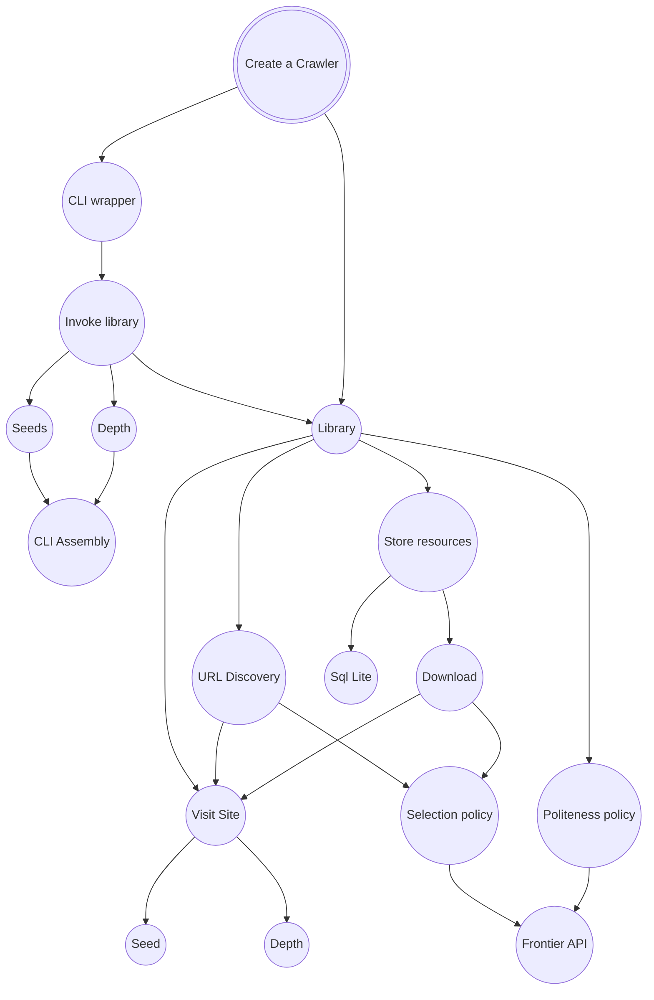

```mermaid
flowchart TD

  Goal((("Create a Crawler")))

  Goal-->CommandLine  
  CommandLine(("CLI wrapper"))
    
    CommandLine-->InvokeCrawlerLibrary
    InvokeCrawlerLibrary(("Invoke library"))

        InvokeCrawlerLibrary-->Library

        InvokeCrawlerLibrary-->SeedFlag
        SeedFlag(("Seeds"))

        InvokeCrawlerLibrary-->DepthFlag
        DepthFlag(("Depth"))

            SeedFlag-->CreateCLIAssembly
            DepthFlag-->CreateCLIAssembly
            CreateCLIAssembly(("CLI Assembly"))

  Goal-->Library
  Library(("Library"))
    
    Library-->Visit
    WebsiteDiscovery-->Visit
    DownloadContent-->Visit
    Visit(("Visit Site"))

    Visit-->InitialSeed
    InitialSeed(("Seed"))

    Visit-->InitialDepth
    InitialDepth(("Depth"))

    Library-->WebsiteDiscovery
    WebsiteDiscovery(("URL Discovery"))

    Library-->StoreResources
    StoreResources(("Store resources"))

        StoreResources-->Database
        Database(("Sql Lite"))

        StoreResources-->DownloadContent
        DownloadContent(("Download"))
        
    WebsiteDiscovery-->SelectionPolicy
    DownloadContent-->SelectionPolicy
    SelectionPolicy(("Selection policy"))

    Library-->PolitenessPolicy
    PolitenessPolicy(("Politeness policy"))

  SelectionPolicy-->FrontierAPI
  PolitenessPolicy-->FrontierAPI
  FrontierAPI(("Frontier API"))
```
